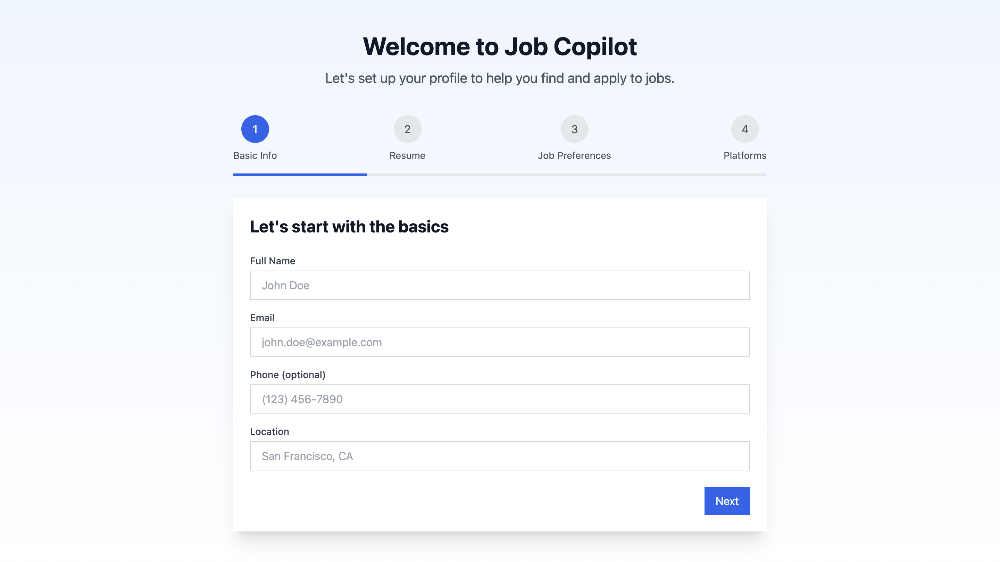

# 🤖 Job Copilot



🚀 **Live Demo:** [Job Copilot](https://basit-dev-de.github.io/job-copilot/)

## 📌 Overview
The **Job Copilot** is an intelligent job application assistant that helps you **track, manage, and automate your job search**. Whether you're applying to multiple positions or following up on leads, this tool keeps everything organized in one place.

## ✨ Features
- ✅ **Job Tracking System** – Keep track of all job applications in an intuitive dashboard.
- 🔔 **Automated Alerts** – Get notified when you receive job-related emails.
- 📊 **Application Status Updates** – Categorize jobs as **applied, interview, offer, rejected**.
- 📅 **Follow-up Reminders** – Never miss a chance to reconnect with recruiters.
- 🎨 **Responsive UI** – Works seamlessly across mobile, tablet, and desktop.
- 🚀 **Built with React & TypeScript** – Ensuring performance and scalability.
- 🔥 **n8n Workflow Integration** – Automates job tracking by extracting important emails and sending notifications.

## 🛠 Tech Stack


## 📦 Installation & Setup
Clone the repository and install dependencies:
```sh
git clone https://github.com/basit-dev-de/job-copilot.git
cd job-copilot
npm install
```

### 🚀 Run the Application
```sh
npm run dev
```

## 🤝 Contribution
Contributions are welcome! Feel free to fork the repo and submit a pull request.

## 📬 Connect with Me
- **GitHub:** [basit-dev-de](https://github.com/basit-dev-de)
- **Portfolio:** [Website](https://basit-dev.com)
- **Email:** [basit.ali@toptal.com](mailto:basit.ali@toptal.com)

🚀 **Make your job search smarter with Job Copilot!**

